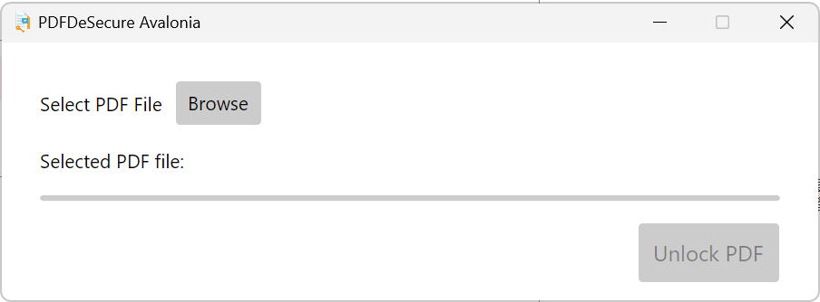

  

## Description ##

An easy-to-use PDF Unlocker. Remove copy-protection from PDF files.  
Modernized on Avalonia with NativeAOT.  
Icon generated with Gemini.  

## How To ##

* Select your PDF Protected File (Browse).
* Click 'Unlock' button and Save the Un-Protected PDF File. 

 

## Tested on ##

**OS**: Windows 11 x86_64   
**CPU**: Intel Core i9-13980HX @ 5.8GHz   
**Memory**: 32767MiB   

## Build ##

* Use Visual Studio 2022  
* Open application's solution file (PDFDeSecure.sln)  

## Author ##
Origin: 
Batsakidis Athanasios  
a.batsakidis@re-think.gr

Modernized:  
QINLILI  

